# Hardin Trips — Training Guide

A walkthrough of the Trips app for the whole family: how to sign in, find your way around a trip, and add memories<!-- only: admin user -->, plus how to plan trips with the booking inbox and AI assistant<!-- /only --><!-- only: admin -->, and the admin tools for managing them<!-- /only -->.

<!-- only: readme -->
> 📄 **Printable guides, one for each role:**
> [Admin guide](Hardin-Trips-Admin-Guide.pdf) · [User guide](Hardin-Trips-User-Guide.pdf) · [Guest guide](Hardin-Trips-Guest-Guide.pdf)
>
> This page is the complete guide, the same as the admin PDF. The screenshots use made-up sample trips. Your own trips and names will be different. To regenerate the screenshots and PDFs after the app changes, see [`tools/README.md`](tools/README.md).
<!-- /only -->
<!-- for: admin
> This is the **admin** edition: everything in the app, including the admin tools. The screenshots use made-up sample trips, so your own trips and names will be different.
-->
<!-- for: user
> This is the **user** edition, for family members who plan their own trips. The screenshots use made-up sample trips, so your own trips and names will be different.
-->
<!-- for: guest
> This is the **guest** edition, for family members Erik has shared trips with. The screenshots use made-up sample trips, so your own trips and names will be different.
-->

## Contents

1. [Signing in](#1-signing-in)
2. [Who can do what](#2-who-can-do-what)
3. [The home screen](#3-the-home-screen)
4. [A trip's itinerary](#4-a-trips-itinerary)
5. [Memories: notes and photos](#5-memories-notes-and-photos)
6. [Quick-editing a day's activities](#6-quick-editing-a-days-activities)
7. [The Overview tab](#7-the-overview-tab)
8. [The Logistics tab](#8-the-logistics-tab)
9. [The Changes tab](#9-the-changes-tab)
10. [The Wishlist tab](#10-the-wishlist-tab)
11. [Sharing a trip](#11-sharing-a-trip)
12. [Creating a trip](#12-creating-a-trip)
13. [Editing a trip](#13-editing-a-trip)
14. [The Booking Inbox](#14-the-booking-inbox)
15. [The AI Trip Assistant](#15-the-ai-trip-assistant)
16. [The world map](#16-the-world-map)
17. [The admin screen](#17-the-admin-screen)
18. [The iPhone app](#18-the-iphone-app)
19. [Tips and FAQ](#19-tips-and-faq)

---

## 1. Signing in

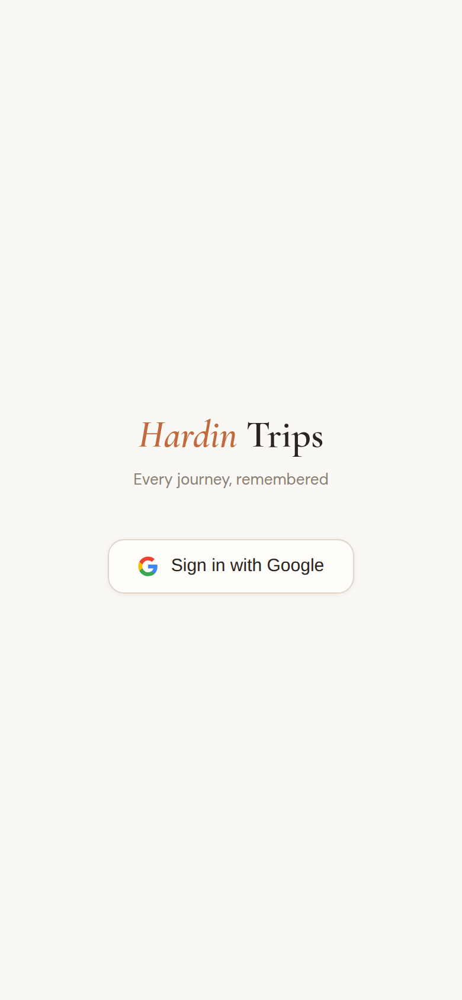

Open the app and choose how to sign in. There are three ways, and each one works with the email address Erik gave access to:

- **Sign in with Google**: tap it and pick your Google account.
- **Sign in with Apple**: tap it and use your Apple ID. If Apple asks, choosing **Share My Email** is simplest. If you choose **Hide My Email**, Apple makes up a private address, and Erik has to add that address instead (the app shows it to you).
- **Email and password**, for any other email (Yahoo, Outlook, iCloud, work). Use the boxes under *or use your email*. The first time, you create an account (below). After that, type your email and password and tap **Sign in**.

If you forget your password, type your email and tap **Forgot password?**. The app emails you a link to choose a new one.

 

### Creating an email and password account

| 1. Fill in the form | 2. Verify your email | 3. Wait for Erik |
|:-:|:-:|:-:|
| 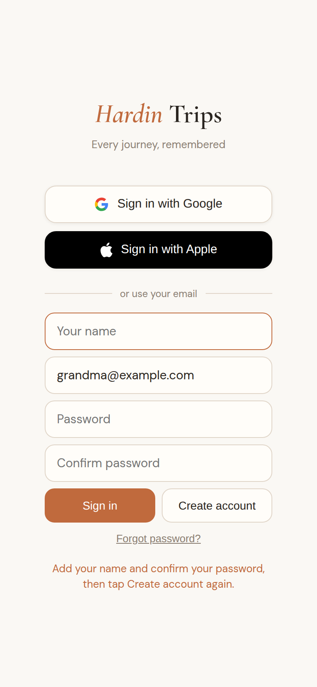 | 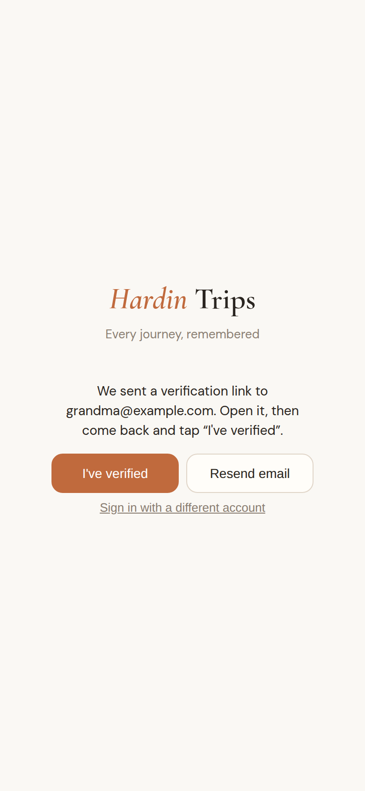 | 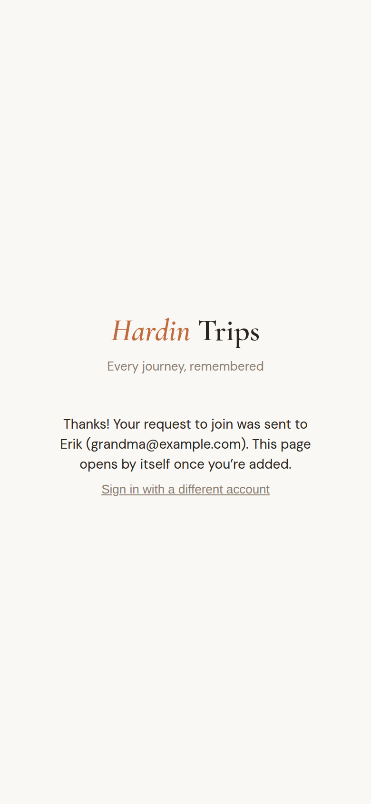 |

1. Type your email and a password, then tap **Create account**. Two more boxes appear: **Your name** and **Confirm password**. Fill them in (the password needs at least 8 characters) and tap **Create account** again.
2. The app sends you a verification email. Open it, tap its link, then come back to the app and tap **I've verified**. Didn't get it? Tap **Resend email**.
3. If Erik already added your email, the app opens. If not, the app sends him a request for you and shows *"Thanks! Your request to join was sent…"*. Leave the page open, or come back later: it opens by itself once you're approved.

The request step works the same way with Google and Apple. To try another account, tap **Sign in with a different account**.

### Installing, signing out and deleting your account

- **Install it like an app:** in Safari, tap **Share → Add to Home Screen**. The app then opens full-screen with its own icon. You can also use the real iPhone app ([section 18](#18-the-iphone-app)).
- **To sign out**, tap the 🔒 lock in the top-right corner of the home screen, then **Sign out**.
- **To delete your account**, tap the 🔒 lock, then **Delete account**. You confirm with your sign-in one more time. This removes your sign-in and your access. Trips you created stay in the app for everyone else.

## 2. Who can do what

Every account has one of three roles. <!-- only: admin -->Admins set roles under **Admin → User Access** ([section 17](#user-access)).<!-- /only --><!-- for: user guest
Erik sets each person's role.
-->

| | Guest | User | Admin |
|---|:-:|:-:|:-:|
| See trips | Only trips they've been given | Their own trips, plus any shared with them | All trips |
| Add memories, wishlist ideas, quick activity edits | ✅ on their trips | ✅ | ✅ |
| Share a trip link | ✅ | ✅ | ✅ |
| Create new trips | — | ✅ (their own) | ✅ |
| Edit trip details, Logistics tab | — | ✅ on their own trips and trips shared with them | ✅ |
| World map | — | — | ✅ |
| Booking inbox and AI assistant | — | ✅ (their own bookings, on trips they can edit) | ✅ |
| Admin tools (users, packing template, PDFs, CSV import…) | — | — | ✅ |

---

## 3. The home screen

<!-- only: admin -->
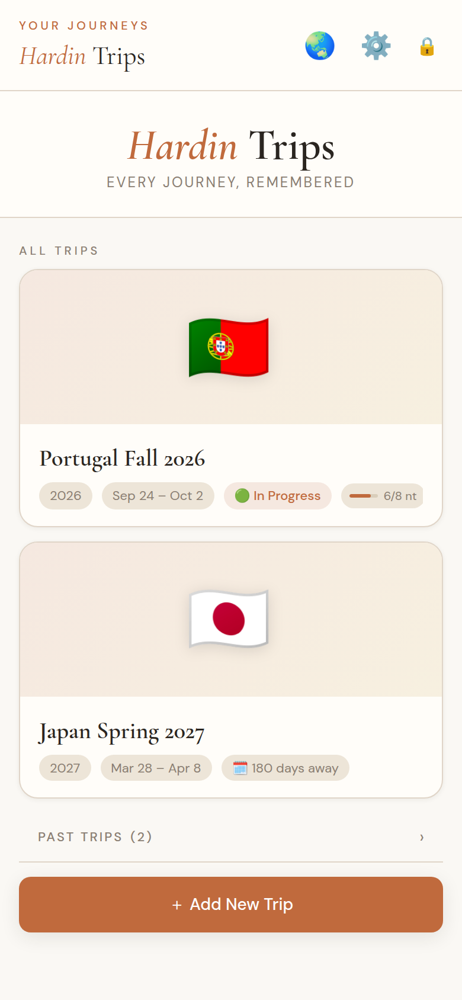
<!-- /only -->
<!-- for: user
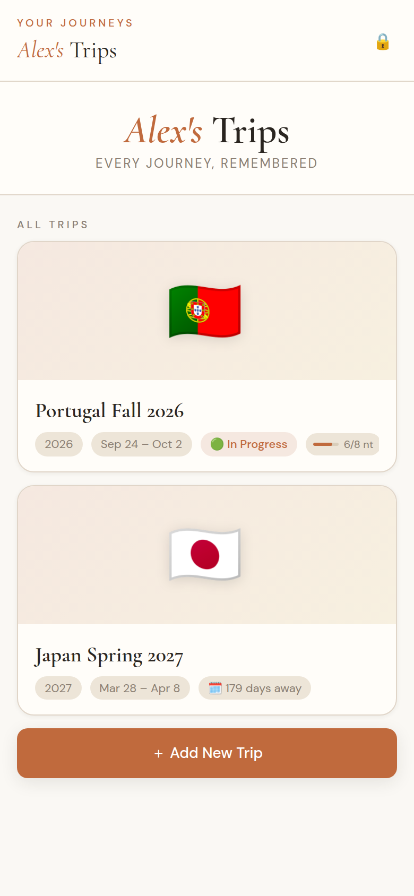
-->
<!-- for: guest
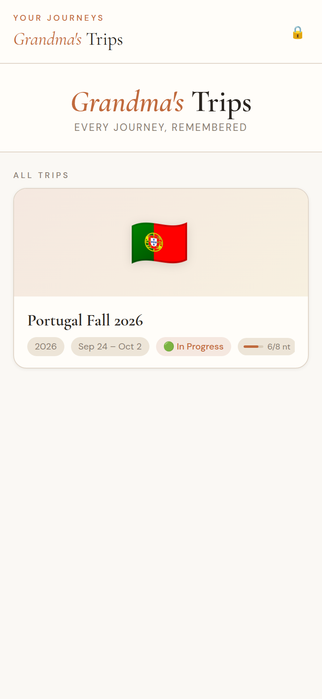
-->

The home screen lists your trips as cards:

- **In progress** trips come first. They show a 🟢 badge and a bar counting nights completed (for example, *6/8 nt*).
- **Upcoming** trips come next, soonest first, with a countdown (*180 days away*).
- **Past trips** are grouped in a collapsed section at the bottom. Tap it to expand.

Tap a card to open the trip. **When a trip is in progress, the app opens straight to it.** Tap **‹** to get back to the list.

<!-- for: user
The header shows your own name (*"Alex's Trips"*). Header buttons:

- ⚙️ **Settings**: opens **My Trips**, with your Booking Inbox ([section 14](#14-the-booking-inbox)), Add New Trip ([section 12](#12-creating-a-trip)) and the AI Trip Assistant ([section 15](#15-the-ai-trip-assistant)). A number on the gear counts bookings waiting in your inbox.
- 🔒 **Sign out** or delete your account.

 

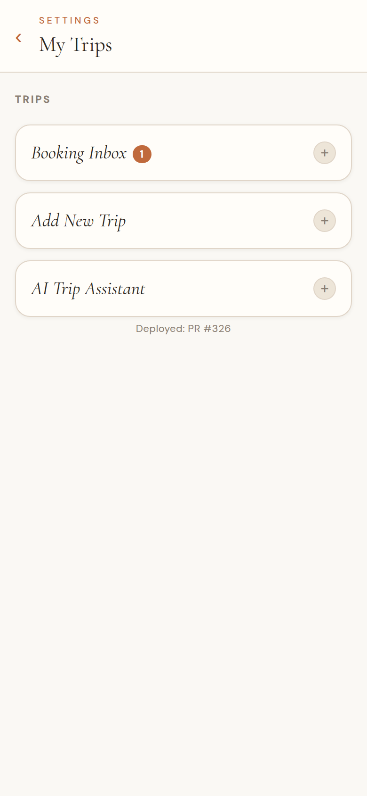

Your **Settings** screen. Tap a section's **＋** to open it.
-->
<!-- for: guest
The header shows your own name (*"Grandma's Trips"*). Tap 🔒 to sign out or delete your account.
-->
<!-- only: admin -->
Header buttons:

- 🌏 **World Map**: every place you've been ([section 16](#16-the-world-map)).
- ⚙️ **Admin**: the admin tools ([section 17](#17-the-admin-screen)). A number on the gear counts bookings waiting in the Booking Inbox ([section 14](#14-the-booking-inbox)).
- 🔒 **Sign out**.
<!-- /only -->

<!-- only: admin user -->
**＋ Add New Trip** at the bottom starts a new trip ([section 12](#12-creating-a-trip)).
<!-- /only -->

 

<!-- only: admin -->
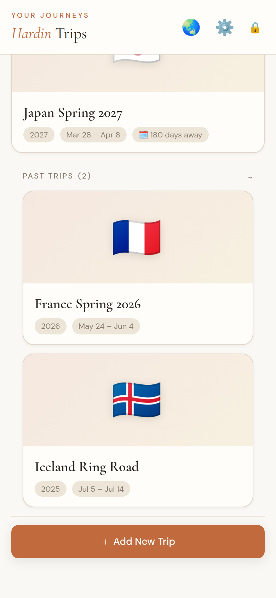
<!-- /only -->

---

## 4. A trip's itinerary

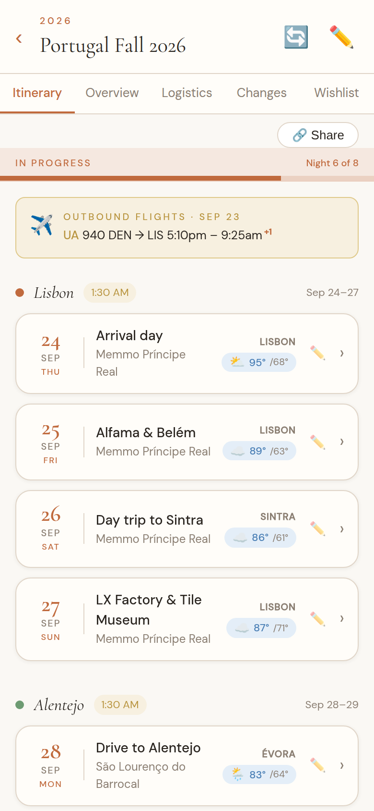

Opening a trip shows the **Itinerary** tab. Along the top are the other tabs: <!-- only: admin user -->**Overview**, **Logistics**, **Changes** and **Wishlist**. Which tabs you see depends on your role and the trip's status.<!-- /only --><!-- for: guest
**Overview**, **Changes** and **Wishlist**.
-->

From top to bottom:

- **🔗 Share** creates a link anyone can open without signing in ([section 11](#11-sharing-a-trip)).
- **In Progress** bar: shows how far into the trip you are (*Night 6 of 8*).
- **Flight banners** for outbound and return flights. A red **+1** means the flight lands the next day.
- **Region headers** (*Lisbon*, *Alentejo*…) group days by area, with the region's dates and a **pill showing the current local time there**.
- **Day cards**: date, what the day is about, the hotel, the city, and a **weather pill** (forecast high/low for upcoming days, actual weather for past days). A 🗣️ chip appears on days in a foreign-language country; tap it for useful local phrases.

In the header, 🔄 refreshes the current tab<!-- only: admin user --> and ✏️ opens the full trip editor ([section 13](#13-editing-a-trip))<!-- /only -->.

 

### Inside a day

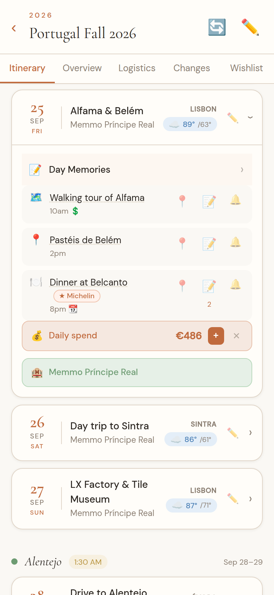

Tap a day card to expand it. **Today's** card is outlined and marked *TODAY*, and the app scrolls to it automatically.

- **📝 Day Memories** holds notes and photos about the day as a whole.
- Each **activity** shows its time and booking status:

  | Icon | Meaning |
  |:-:|---|
  | 📆 | Booked |
  | 💲 | Paid |
  | 🗓️ | Not booked yet |
  | 🚫 | No reservations taken |
  | 🚶🏼 | Walking in |
  | ★ Michelin | Michelin-starred restaurant |
  | 🚗 driving | You'll drive to this one |

- Tap an **activity's name** to search for it on Google.
- **📍** opens the place in Google Maps or Waze (see below).
- **📝** opens that activity's memories. The small number underneath counts how many there are.
- **🔔** (in-progress trips, activities with a time): sets a phone reminder telling you when to leave. It uses the drive time when one is known, otherwise 30 minutes early. Reminders can only be set up to 3 days ahead.
<!-- only: admin -->
- **💰 Daily spend** (Erik's account only): tap **+ add** to log what you spent that day. The trip total appears in Logistics.
<!-- /only -->
- The green bar at the bottom shows that night's **hotel**.
- **✏️** on the day card opens the quick activity editor ([section 6](#6-quick-editing-a-days-activities)).

 

### Opening a place in Maps

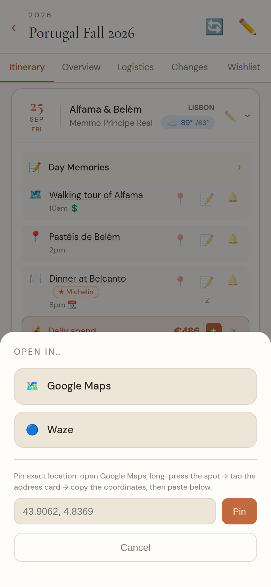

Tapping 📍 asks whether to open **Google Maps** or **Waze**.

If the app pins the wrong spot, you can fix it: in Google Maps, long-press the correct location, copy the coordinates from the address card, paste them into the box here, and tap **Pin**. The app remembers the corrected location for maps and drive times.

 

---

## 5. Memories: notes and photos

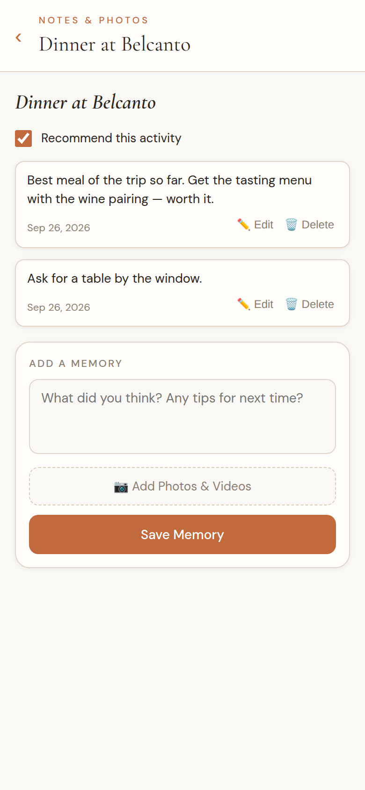

Tap **📝** next to an activity, or **Day Memories** on a day card, to open its memories.

- Type in **Add a Memory**: what you thought, tips for next time, what to order.
- Tap **📷 Add Photos & Videos** to attach pictures or clips from your phone.
- Tap **Save Memory**. Everyone with access to the trip will see it.
- Use **✏️ Edit** or **🗑️ Delete** on your saved memories.
- Tap any photo to view it full-screen. Swipe or use the arrows to move between photos.
- **Zoom in on a photo** by pinching with two fingers or double-tapping the spot you want to see. Drag with one finger to look around while zoomed, and double-tap again (or pinch back out) to return. On a computer, use the scroll wheel or double-click, and drag to pan. Photos are saved at high resolution, so they stay sharp when zoomed.
<!-- only: admin -->
- **Recommend this activity** (admins): marks the activity with ⭐ *Recommended* in the trip's Memories and in shared links.
<!-- /only -->

Adding photos needs an internet connection. See [Tips and FAQ](#19-tips-and-faq) for offline use.

 

---

## 6. Quick-editing a day's activities

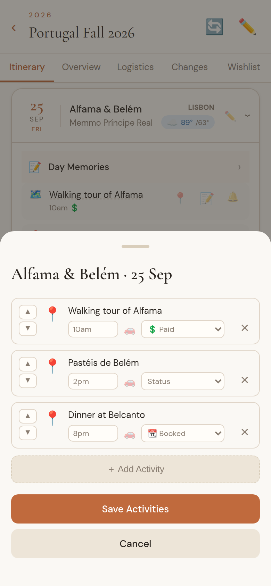

The ✏️ on a day card opens a quick editor for that day's activities:

- **▲ / ▼** reorder activities.
- Change the **time** (use am/pm, like `7:30pm` or `10am–2pm`).
- 🚗 toggles whether you're driving there. That controls the drive-time estimate.
- The **status** menu sets the booking status (Booked, Paid, Not booked…).
- **✕** removes an activity. The app asks first, and offers **Move to Wishlist** if you'd rather keep the idea for later. **＋ Add Activity** adds one.
- Tap **Save Activities** when done.

Every change is recorded in the **Changes** tab.

 

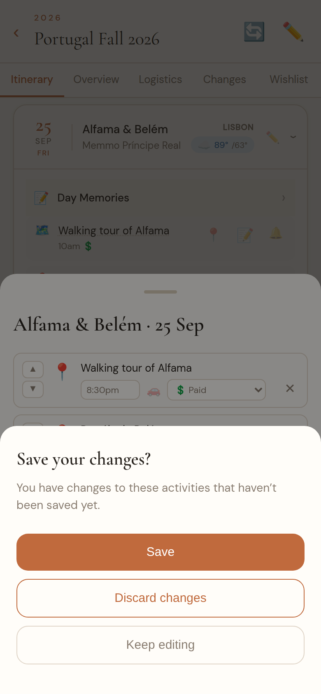

**Unsaved changes are never lost by accident.** If you close the editor (or tap outside it) with changes you haven't saved, the app asks:

- **Save**: keeps your changes.
- **Discard changes**: throws them away.
- **Keep editing**: goes back to the editor.

<!-- only: admin user -->
The same prompt appears in the day editor and the full trip editor ([section 13](#13-editing-a-trip)).
<!-- /only -->

 

---

## 7. The Overview tab

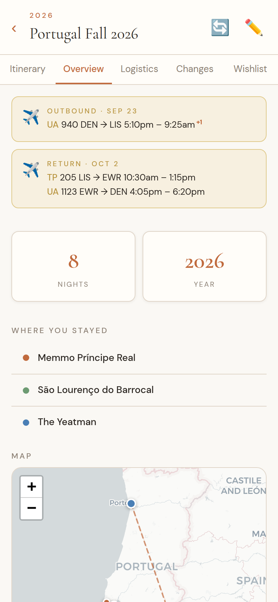

**Overview** is the trip at a glance:

- All **flights**: outbound, any flights during the trip, and return.
- **Stats**: number of nights and the year.
- **Where you stayed**: each hotel, color-coded by region.

 

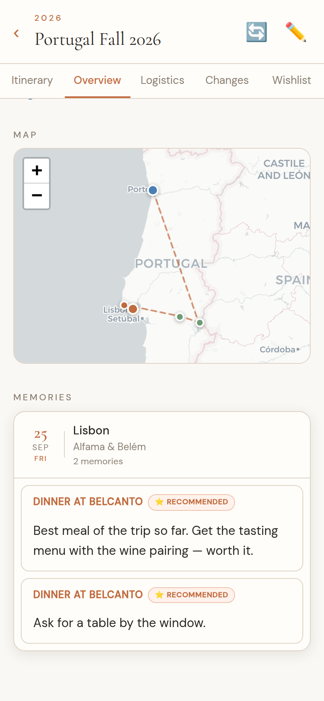

Further down:

- **Map** of the route, with a colored dot for each stop. Pinch or use **+/−** to zoom, and tap a dot to see the city's name.
- **Memories**: every note saved on the trip, grouped by day, with recommended activities highlighted.

 

---

<!-- only: admin user -->
## 8. The Logistics tab

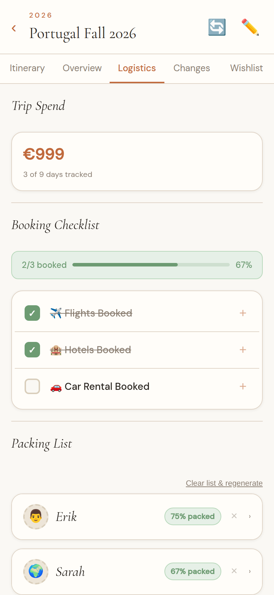

**Logistics** is for getting ready. It appears on upcoming and in-progress trips for people who can manage the trip.

<!-- only: admin -->
- **Trip Spend** (Erik's account only): total of the daily spend entries, with a rough US-dollar conversion.
<!-- /only -->
- **Booking Checklist**: tick off Flights, Hotels and Car Rental. Tap **＋** on a row to add individual items (for example, one line per hotel). The bar shows how much is booked.
- **Packing List**: one list per person (next screenshot).

 

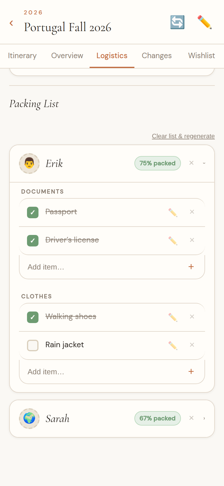

Tap a person to open their packing list:

- Tick items as you pack. The badge shows *% packed*.
- **Add item…** at the bottom of each section adds something new. ✏️ renames an item and ✕ removes it.
- Tap the round avatar to change that person's picture.
<!-- only: admin -->
- **Clear list & regenerate** replaces the lists with a fresh copy of the family template. Admins edit that template under **Admin → Logistics Packing List**.

New trips created by an admin start with the family's packing template automatically.
<!-- /only -->
<!-- for: user
- If a trip has no packing list yet, tap **Start a Packing List**. **Clear list & regenerate** starts the lists over.
-->

 

---
<!-- /only -->

## 9. The Changes tab

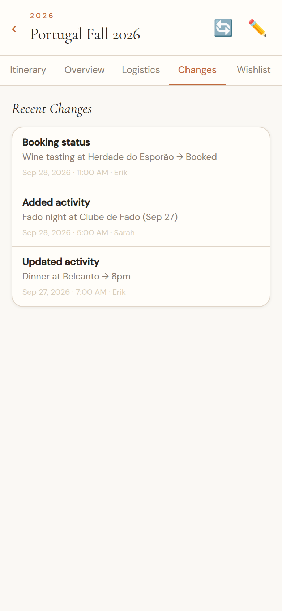

**Changes** lists the 25 most recent edits to the trip: what changed, who changed it, and when. Use it to answer "who moved dinner to 8?"

 

---

## 10. The Wishlist tab

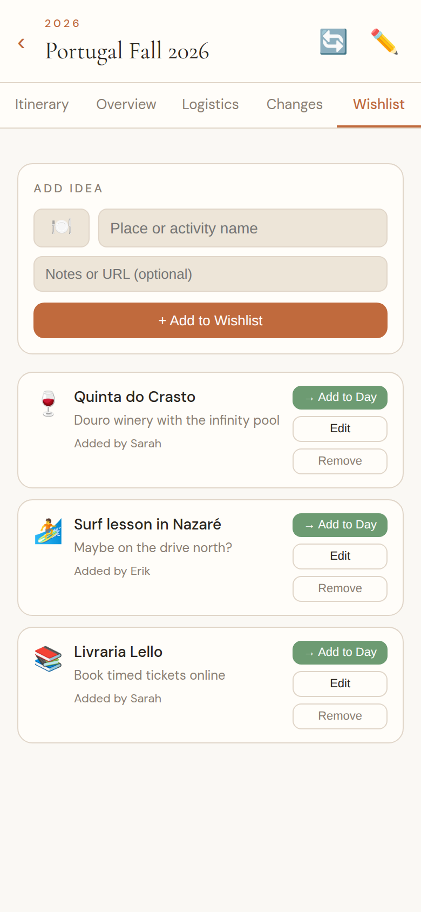

**Wishlist** is a shared scratchpad of places and ideas that aren't on the itinerary yet.

- Enter an emoji, a name, and optional notes or a link, then tap **＋ Add to Wishlist**.
<!-- only: admin user -->
- **→ Add to Day** (people who can manage the trip) moves the idea onto a specific day of the itinerary.
<!-- /only -->
- **Edit** and **Remove** do what they say.

 

---

## 11. Sharing a trip

Tap **🔗 Share** at the top of the Itinerary tab. On a phone, the share sheet opens so you can text or email the link. Otherwise the link is copied to your clipboard.

Anyone with the link can view the trip **without signing in**, read-only. The shared view has two tabs:

| Itinerary | Highlights |
|:-:|:-:|
| 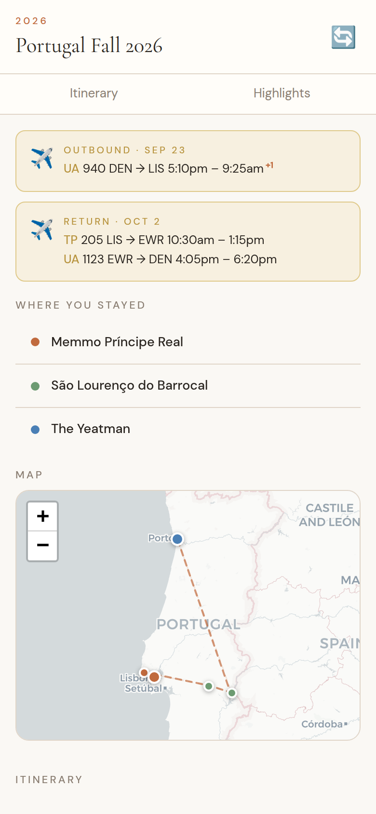 | 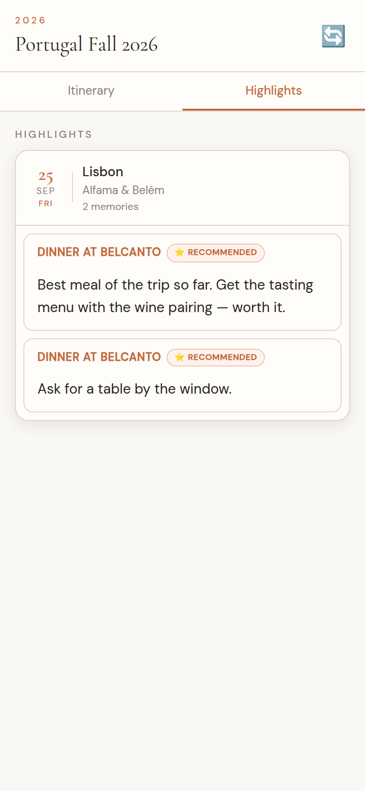 |

- **Itinerary**: flights, hotels, a route map and a day-by-day summary.
- **Highlights**: days with memories, and the activities you recommended.

---

<!-- only: admin user -->
## 12. Creating a trip

<!-- only: admin -->
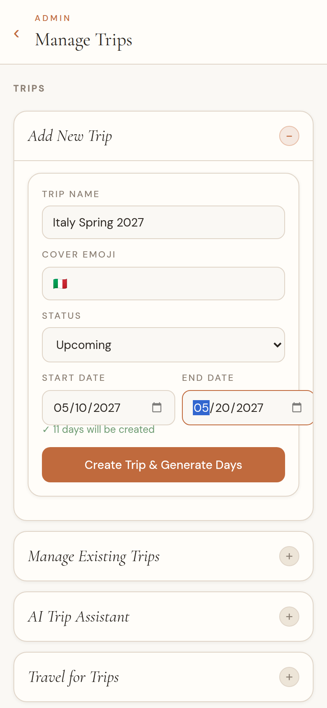

Tap **＋ Add New Trip** at the bottom of the home screen, or open **Admin → Add New Trip**.
<!-- /only -->
<!-- for: user
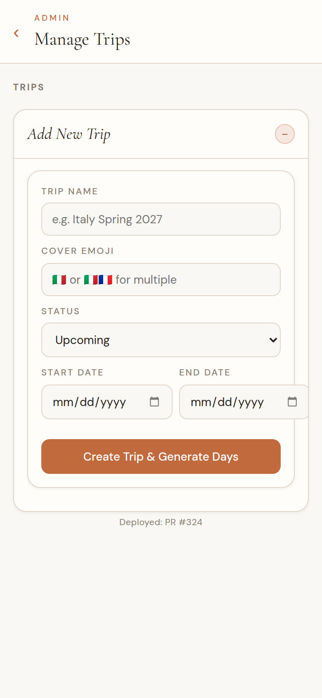

Tap **＋ Add New Trip** at the bottom of the home screen, or tap ⚙️ and open **Add New Trip**.
-->

1. Enter a **trip name** and a **cover emoji** (flags work well).
2. Choose the **status**: *Upcoming*, *Active* or *Past*.
3. Pick the **start and end dates**. The app previews how many days it will create.
4. Tap **Create Trip & Generate Days**.

You get one blank day per date. Fill them in with the trip editor ([section 13](#13-editing-a-trip)), the Booking Inbox ([section 14](#14-the-booking-inbox)) or the AI assistant ([section 15](#15-the-ai-trip-assistant))<!-- only: admin -->, or with a CSV import<!-- /only -->.

<!-- for: user
Trips you create are yours: you can edit them, and they appear only for you and the admins until you share a link.
-->

 

---

## 13. Editing a trip

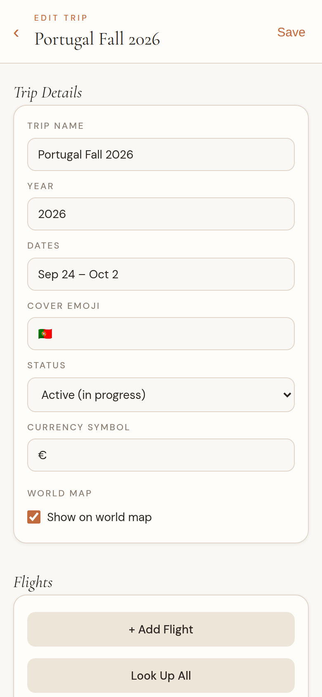

Tap **✏️** in a trip's header<!-- only: admin --> (or **Edit** under **Admin → Manage Existing Trips**)<!-- /only --> to open the full editor.

**Trip Details**: name, year, date text, cover emoji (use two flags for a multi-country trip, like 🇮🇹🇫🇷), status (*Upcoming*, *Active (in progress)* or *Past*), currency symbol for daily spend<!-- only: admin -->, and whether the trip appears on the world map<!-- /only -->.

**Flights**: tap **＋ Add Flight**, enter flight numbers and dates, then tap **Look Up All**. The app fills in routes and times automatically. Flights are sorted into Outbound, Return and In-trip. You can add a traveler's name to a flight when family members fly separately.

Tap **Save** (top-right) or **Save Trip Details** to keep your changes. If you tap **‹** with unsaved changes, including flight numbers you typed but haven't looked up yet, the app asks whether to **Save**, **Discard changes** or **Keep editing**. Removing a flight also asks you to confirm first.

 

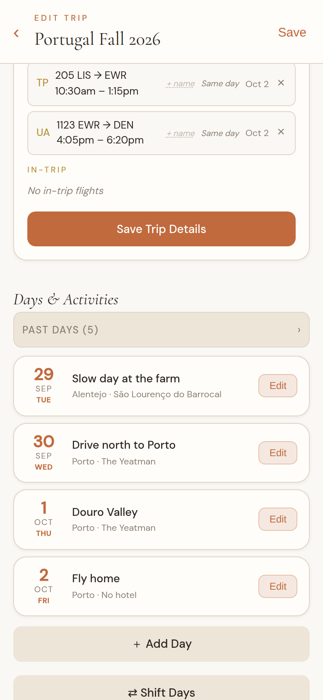

**Days & Activities**: every day of the trip. Days already travelled are collapsed under *Past Days*.

- **Edit** on a day changes its city, hotel, region, region color and activities.
- **＋ Add Day** adds a day to the end of the trip.
- **⇄ Shift Days** moves the whole trip earlier or later, for example when flights change.

 

---
<!-- /only -->

<!-- only: admin user -->
## 14. The Booking Inbox

<!-- only: admin -->
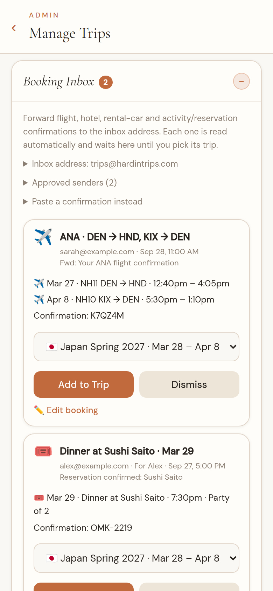
<!-- /only -->
<!-- for: user
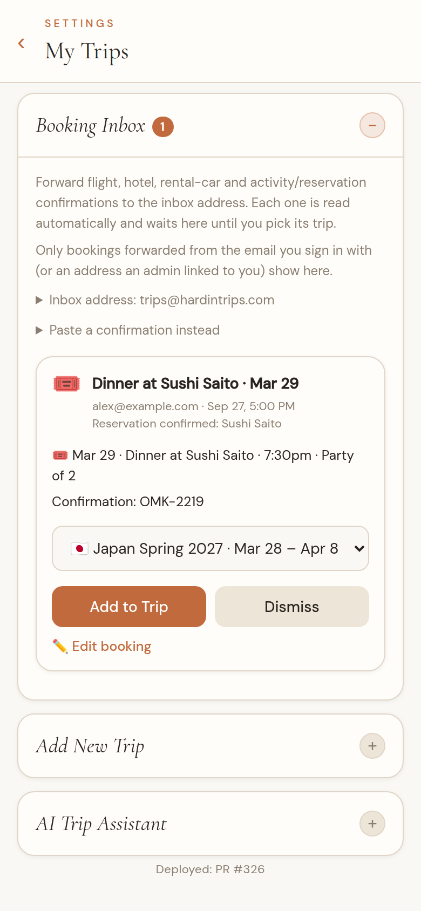
-->

Instead of typing bookings in by hand, **forward the confirmation email** to the inbox address. The app reads it and fills in the details for you. It understands:

- ✈️ **Flights**: flight numbers, routes, times and travelers
- 🏨 **Hotels**: hotel, city, check-in and check-out dates
- 🚗 **Rental cars**: company, pick-up and drop-off
- 🎟️ **Activities and reservations**: restaurants, tours, tastings, tickets, shows, spa bookings

Each forwarded email appears here as a card, and the ⚙️ button shows how many are waiting.<!-- only: admin --> Admins also get a push on the ntfy reminders topic.<!-- /only -->

<!-- only: admin -->
Admins see every forwarded booking. Bookings that belong to a user also show in that user's own inbox, and are marked *For Alex* (their name) here.
<!-- /only -->
<!-- for: user
**You see only your own bookings:** ones forwarded from the email you sign in with, or from another address an admin has linked to you (see the end of this section). The trip menu lists only trips you can edit.
-->

**To add a booking to a trip:**

1. Tap ⚙️ on the home screen, then **Booking Inbox**.
2. Check the details the app read from the email, and the confirmation number.
3. The app picks the trip whose dates match. Choose a different one from the menu if needed.
4. Tap **Add to Trip**.

The booking lands in the right places: flights in the trip's outbound, return or in-trip flights; the hotel on each night's day card, with a check-in activity; rental-car pick-up and return as activities; reservations on their day with their time and a *Booked* or *Paid* status. If the day already has the same place planned (say, *Dinner at Sushi Saito*), that activity is marked booked and given its time instead of being added twice. The matching line on the Logistics **Booking Checklist** is ticked too.

**Dismiss** removes a card without adding it. Added and dismissed bookings move to **Recent** at the bottom. Added ones clear after a day, and dismissed ones after a week (tap **Restore** if you dismissed one by mistake).

If a card says the app *couldn't read this email*, tap **Read Again**, or fix it by hand (next).

 

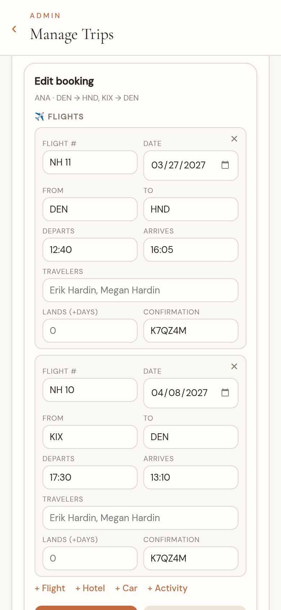

**Fixing a booking before adding it:** sometimes an email is missing a flight or a detail comes through wrong. Tap **✏️ Edit booking** on the card to see everything the app read as a form:

- Change any field: flight number, date, airports, times, travelers, confirmation number.
- **✕** removes a flight, hotel, car or activity from this booking.
- **+ Flight**, **+ Hotel**, **+ Car** and **+ Activity** add one by hand.
- Tap **Save** to update the card, then **Add to Trip** as usual.

**The settings at the top of the inbox** (tap each to open it):

- **Inbox address**: the email address to forward bookings to. It's shown in the summary line, so you can see it without opening it.<!-- only: admin --> To change it, tap **Edit**, type the new address, then tap **Save**. Only admins can change it.<!-- /only -->
<!-- only: admin -->
- **Approved senders** (admins only): anyone in User Access can forward bookings. If someone books from an address that doesn't have an app account (a personal Yahoo account, say), add it here so its emails are accepted. Emails from anyone else are refused. To send that address's bookings to a user's inbox, choose them in the **Belongs to** menu before tapping **Add**. Otherwise its bookings go only to admins.
<!-- /only -->
<!-- for: user
- **Booking from another email?** Forward from the address you sign in with. If you book with a different address, ask Erik to add it as an approved sender linked to you.
-->
- **Paste a confirmation instead**: paste the text of a confirmation and tap **✨ Read Booking**. It appears as a card just like a forwarded email.

 

---

## 15. The AI Trip Assistant

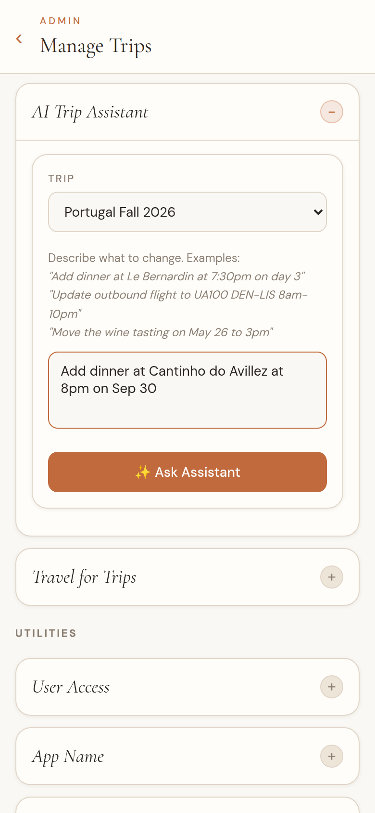

Tap ⚙️ on the home screen, then **AI Trip Assistant**. Pick an upcoming or in-progress trip, then describe a change in plain English:

- *"Add dinner at Le Bernardin at 7:30pm on day 3"*
- *"Update outbound flight to UA100 DEN-LIS 8am-10pm"*
- *"Move the wine tasting on May 26 to 3pm"*

<!-- for: user
The trip menu lists only trips you can edit.
-->
Tap **✨ Ask Assistant**. The proposed changes appear in a preview. Nothing is saved until you tap **Apply Changes**.

**If the trip has no itinerary yet**, the assistant offers two other modes:

- **✍️ Describe & Generate**: enter your travel style, pace, things to avoid and must-dos, then tap **🗺️ Generate Itinerary**.
- **📋 Paste My Notes**: paste notes you've already written (dates, hotels, plans) and tap **📋 Parse My Notes** to turn them into days.

 

---

<!-- /only -->

<!-- only: admin -->
## 16. The world map

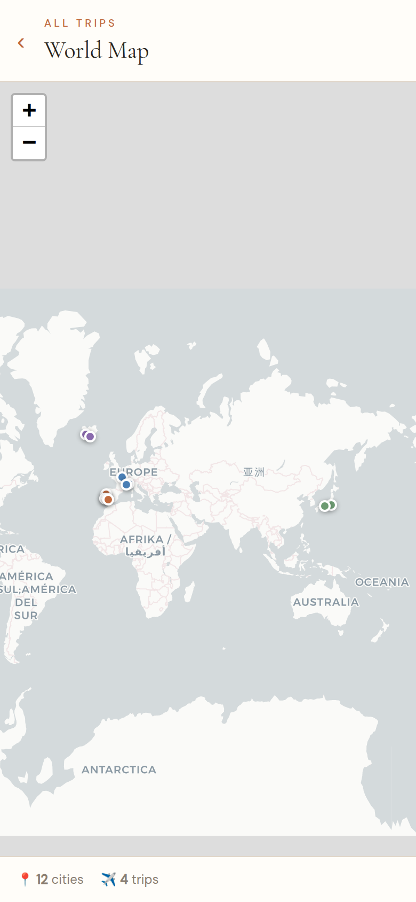

Tap 🌏 on the home screen to see every city from every trip on one map. The totals appear along the bottom. Tap a dot to see what trip it was.

Admins can hide a trip from the map with the **Show on world map** checkbox in the trip editor. Trips created by users are left off the map.

 

---

## 17. The admin screen

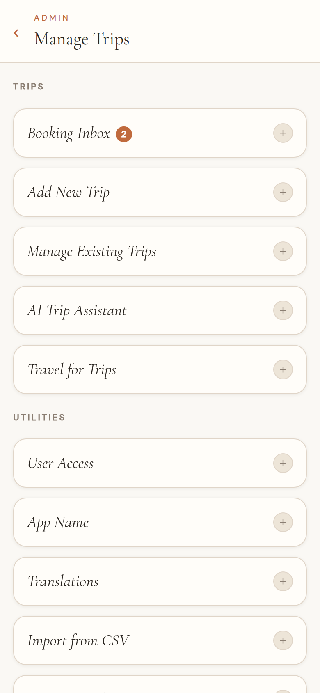

Tap ⚙️ on the home screen. Each section opens and closes with **＋ / −**. The PR number of the currently deployed version is shown at the very bottom.

**Trips**
- Booking Inbox ([section 14](#14-the-booking-inbox))
- Add New Trip ([section 12](#12-creating-a-trip))
- Manage Existing Trips
- AI Trip Assistant ([section 15](#15-the-ai-trip-assistant))
- Travel for Trips

**Utilities**
- User Access
- App Name
- Translations
- Import from CSV
- Logistics Packing List
- Create Trip PDF

Users get the ⚙️ button too. Theirs opens **Settings → My Trips**, with only the Booking Inbox, Add New Trip and the AI Trip Assistant.

 

### Manage existing trips

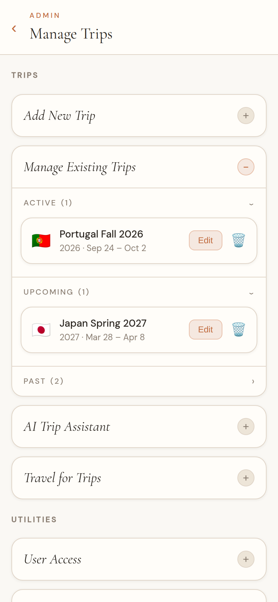

Trips are grouped into Active, Upcoming and Past. Tap **Edit** to open the trip editor, or 🗑️ to delete a trip. You'll be asked to confirm, and deleting can't be undone.

 

### Travel for Trips

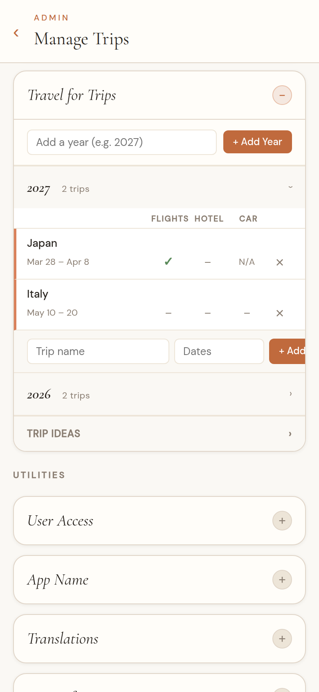

A year-by-year planning tracker, separate from the trips themselves. Tap the **Flights**, **Hotel** and **Car** cells on each row to cycle through *–* (to do), *✓* (booked) and *N/A*. Rows with anything still to do are marked in orange.

- **＋ Add Year** starts a new year. Enter a trip name and dates, then tap **＋ Add**.
- **Trip Ideas** is a list, for each year, of trips you're thinking about but haven't planned yet.
- Once a day, admins get a pop-up at sign-in listing trips with bookings still outstanding.

 

### User Access

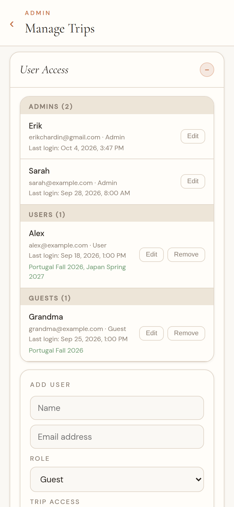

Everyone who can sign in is listed here, grouped into Admins, Users and Guests, with their last sign-in time.

**Waiting for access** appears at the top when someone has signed in but isn't on the list yet. It shows their name, email and how they signed in (Google, Apple or email and password). Admins also get a toast when they open the app, and a push on the ntfy reminders topic when a new request arrives.

- **Approve** fills in the Add User form with their name and email. Choose a role and trips, then tap **Add User**. The request disappears, and their screen opens the app on its own.
- **Dismiss** removes the request without giving access. If they sign in again, a new request appears.

**To add someone:**

1. Enter their **name** and the **email address they'll sign in with**. Any email works: Google, Apple or email and password. For someone who used Apple's **Hide My Email**, enter the `…@privaterelay.appleid.com` address the app showed them.
2. Choose a **role** (see [section 2](#2-who-can-do-what)).
3. For guests and users, tick the **trips** they should see.
4. Tap **Add User**.

Use **Edit** to change someone's role or trips, and **Remove** to revoke access.

 

### Other utilities

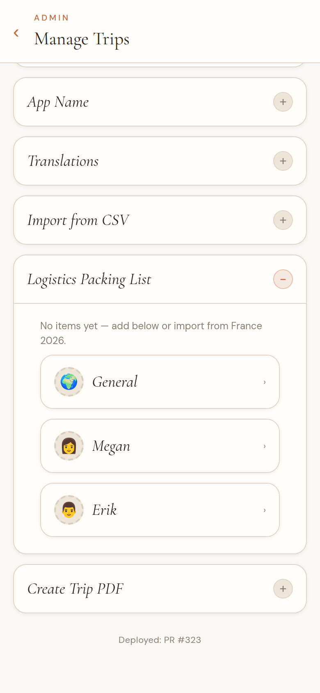

- **App Name**: the family name shown in the header ("*Hardin* Trips").
- **Translations**: choose which cities or regions get the 🗣️ phrase chip. Add a keyword that matches the day's city or region, plus the country code.
- **Import from CSV**: bulk-load days into a trip. Pick the trip, then choose a file or paste the data. Columns: `Date, Day, City, Hotel, Activities, Region, RegionColor`. Separate activities with `|`.
- **Logistics Packing List**: the family packing template (one list per person) that new trips start with.
- **Create Trip PDF**: a printable itinerary for any trip (next screenshot). In the iPhone app the PDF opens inside the app. Tap **📤 Share PDF** to save it to Files, email it, AirDrop it or print it.

 

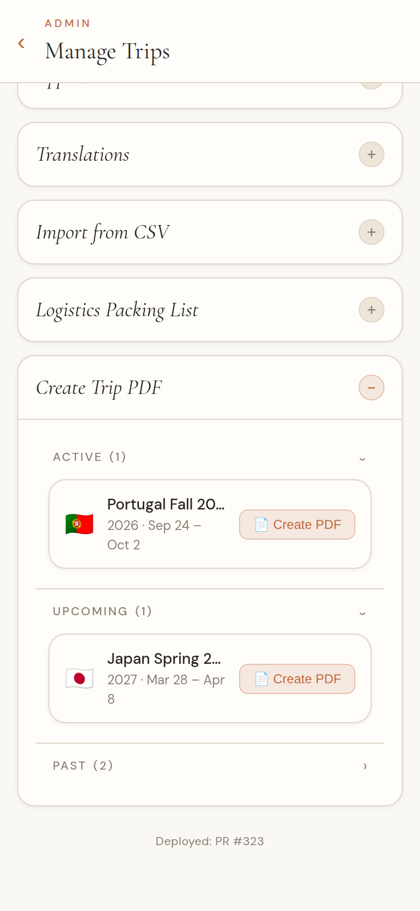

---
<!-- /only -->

## 18. The iPhone app

Besides opening the website in Safari, there's a real **Hardin Trips** app for iPhone. It's shared through Apple's **TestFlight** app rather than the App Store.

**To install it:**

1. Send Erik the email address of your Apple ID. He invites you as a tester.
2. Accept the invitation email from Apple.
3. Install **TestFlight** from the App Store, open it, and tap **Install** next to Hardin Trips.

**Signing in** works the same as on the website ([section 1](#1-signing-in)). **Sign in with Google** and **Sign in with Apple** open the iPhone's own sign-in sheets.

**Updates are automatic.** The app always shows the latest version of Trips, so you never need to update it for new features. Every few months TestFlight offers a new build of the app itself. Install it when asked, because older builds stop opening after 90 days.

**No signal?** The app shows *Can't reach Hardin Trips* with a **Try again** button.

**Upcoming Trips widget:** the app comes with a home-screen widget that shows countdowns to your next trips and the flights, hotels or cars still to book.

1. Touch and hold an empty spot on the home screen until the apps jiggle.
2. Tap **+** (or **Edit → Add Widget**) in the top corner.
3. Search for **Hardin Trips**, pick the small or medium size, and tap **Add Widget**.

The widget refreshes about once an hour. Tap it to open the app.

---

## 19. Tips and FAQ

<!-- only: admin -->

**What does a guest see?** Only the trips they've been given, with no ⚙️ Admin button or world map. The header uses their own name ("*Grandma's* Trips"). Guests can read everything on their trips and add memories and wishlist ideas. Users see the same, plus their own trips, **＋ Add New Trip**, and a ⚙️ **Settings** screen with their own Booking Inbox and the AI assistant.
<!-- /only -->

**Does it work offline?** Mostly. The app keeps a copy of your trips on the phone. With no signal, a banner reads *📴 Offline — viewing saved data*. You can still read everything, and edits you make are sent when you're back online. Photo uploads and maps need a connection.

**I don't see my change.** Tap 🔄 in the trip header to refresh the current tab.

<!-- only: admin user -->
**Why can't I see the Logistics tab?** It only appears on upcoming and in-progress trips, and only for people who can manage the trip.
<!-- /only -->
<!-- for: user
**I can't find a trip.** You see the trips you created plus the ones Erik has shared with you. Ask him to share the one you're missing.
-->
<!-- for: guest
**I can't find a trip.** You see only the trips Erik has shared with you. Ask him to share the one you're missing.
-->

**Can I undo a change?** There's no undo button, but the **Changes** tab shows what the value was, so you can put it back by hand.

**A place is pinned in the wrong spot on the map.** Fix it with the Pin option in the Maps sheet ([section 4](#opening-a-place-in-maps)).

<!-- only: admin user -->
**The weather or local time is for the wrong place.** The app may have matched the day's city to a different place with the same name (for example, *Kona* in India instead of Hawaii). Make the city more specific in the day editor (*Kailua-Kona*). The weather pill and the region's clock update to the new place.
<!-- /only -->

<!-- only: admin -->
 
<!-- /only -->
